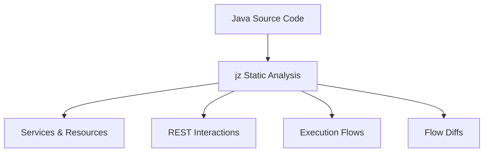
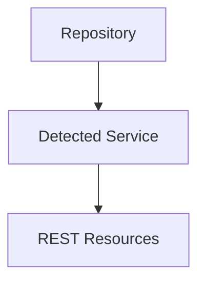
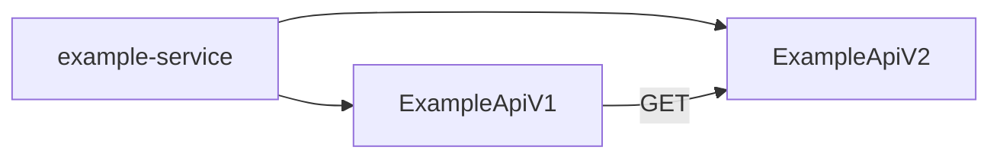
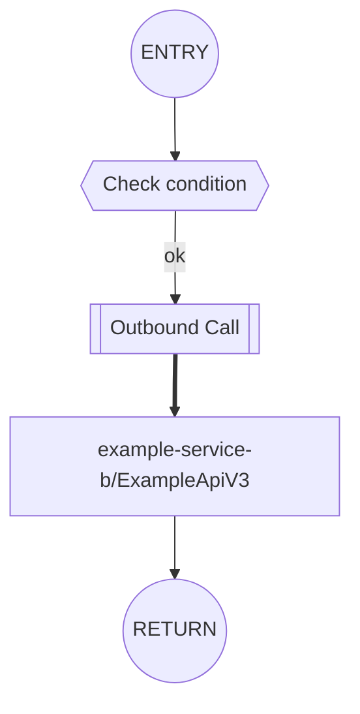
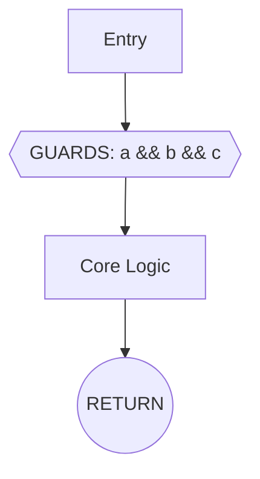
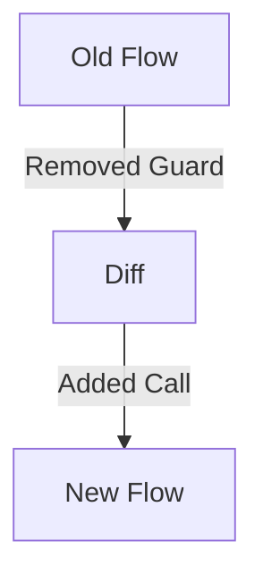
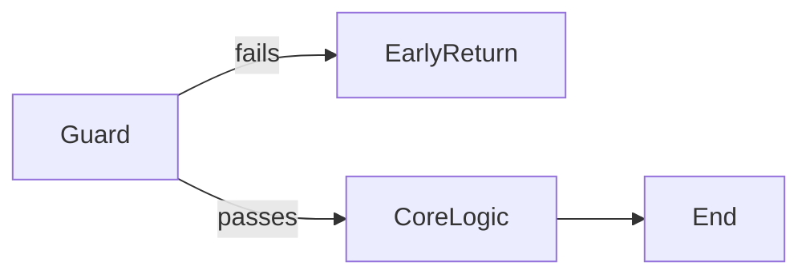
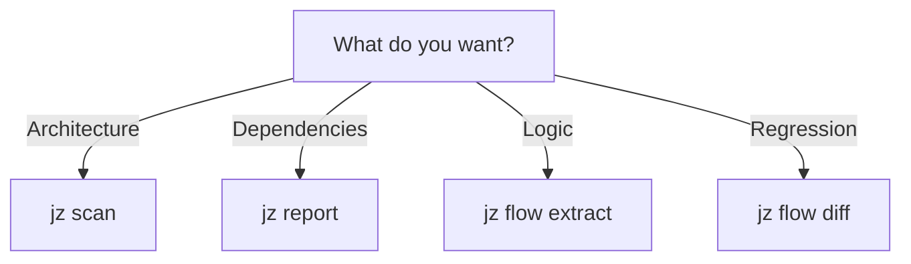

# jz Quickstart (Mermaid-only)

This quickstart introduces **jz** using GitHub-renderable Markdown and Mermaid diagrams only.
No screenshots. No runtime execution. Pure static analysis.

ℹ️ This is a diagram-only companion. For full narrative explanations, see the [narrative Quickstart](./quickstart.md).

---

## What jz Does



jz analyzes Java source code **without running it**, extracting:
- REST entry points
- Cross-service calls
- Handler execution flows
- Structural diffs between versions

---

## Installation

```bash
go install ./cmd/jz
```

Requires **Go 1.21+**.

---

## 1. Scan a Codebase

```bash
jz scan .
```



Purpose:
- Detect services (OSGi bundles or Liberty WAR)
- List REST resources and endpoints
- Surface diagnostics

---

## 2. Full Static Report

```bash
jz report markdown .
```



Generates:
- Service summaries
- REST resource listings
- Confidence and resolution metadata

---

## 3. REST Interaction Graph

```bash
jz report mermaid . --calls
```

```mermaid
graph TD
    A[example-service-a/ExampleApiV1] -->|GET [same]| B[example-service-a/ExampleApiV2]
    A ==> |POST [cross]| C[example-service-b/ExampleApiV3]
    A -.-> |unresolved| D[UNKNOWN]
```

Legend:
- `-->` same-service
- `==>` cross-service
- `-.->` unresolved

---

## 4. Targeted Execution Flow

```bash
jz flow extract . --resource ExampleApiV1
```



Shows:
- Guards
- Internal calls
- Outbound REST calls
- Explicit termination

---

## 5. Compact Flow View

```bash
jz flow extract . --resource ExampleApiV1 --format mermaid --compact
```



Use `--compact` to collapse guard chains for readability.

---

## 6. Flow Diff Between Versions

```bash
jz flow diff ./v1 ./v2 --resource ExampleApiV1
```



Diff guarantees:
- Ordered comparison
- No reordering tolerance
- Structural-only changes

---

## How to Read Results



- Guards gate logic
- Early returns are explicit exits
- Unresolved calls are expected and safe

---

## Safety Guarantees

- No code execution
- No runtime assumptions
- No speculative linking
- False negatives preferred over false positives

---

## When to Use Which Command



---

## Next Steps

- Add to CI for architectural drift detection
- Review flows during refactors
- Use diffs for design reviews

---

**End of Quickstart**
